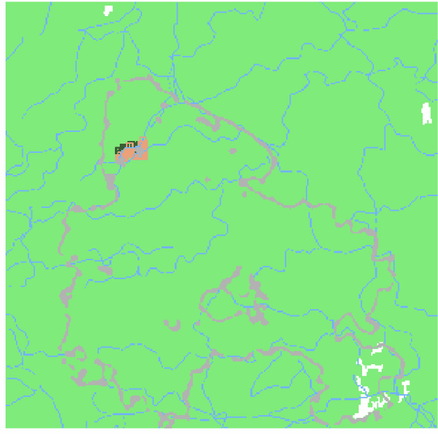

# Determining the Effect of Wind on a CA-based Fire Propagation Model
by Elias Gabriel and Erika Lu

# Abstract
While cellular automata have often been used to simulate wildfires, a devastating fire that hit the forests of Southern Portugal in 2012 exhibited an explosive behavior that was not well captured by existing models. Models for fire spread are valuable to disaster relief organizations and volunteers, as they can help identify where relief resources can be allocated. In these cases, it is important for models to reasonably accurately predict spread patterns and disaster zones.

We attempted to answer whether or not the inclusion of wind data in a fire-modeling cellular automata has a substantial impact on the overall behavior of a system. We replicated a model proposed by Freire et al. and make use of NumPy to perform iterative probability-based array operations. We visualized the results using Seaborn and matplotlib and conclude, in agreement with the original authors, that the inclusion of wind data has a very substantial impact on the spread of fire under numerous environmental conditions.

The code behind our data parsing and aggregation is avalibale on [Binder](https://mybinder.org/v2/gh/thearchitector/wind-and-fire/e30c753b886af94fa0e0a8c2e71178739dcb3bb1).
You can follow along and run the code behind our CA and analysis on [Google Colab](https://colab.research.google.com/drive/1oxDOWZ2jLf-vwF6y1FeO4pElzdakRbbm).

# Replication of Base Model
Freire et al. proposed that the incorporation of wind speeds in forest models may create more accurate explanations of fire spread. As an initial experiment, our objective was to verify their claims and determine whether factoring in winds creates a better model by comparing our models with real world wildfire data. We replicated their initial cellular model, which adjusts burn and spread probabilities depending on wind speed and direction.

Before attempting to replicate the results produced in the paper, we needed to collect the necessary data. We collected data from the original authors as well as their cited sources—fields including vegetation type, vegetation density, wind speed, wind direction, and elevation—for the 29km x 28km area of study in Portugal between (37.1329216°N, -7.9493189°W) and (37.388191°N, -7.6170562°W)

Each of those fields had an effect on the likelihood of a cell burning, which the paper defined to be:

```python
p_burn = P_0(1 + vegetation density)(1 + vegetation type contribution)(wind contribution)(slope contribution)`
```

Using that equation, we calculated the effective burn probabilities for every cell in our CA and stored them in a NumPy array. By using logical set operations, specifically

```python
# divide timestep by 3 because our dt is 20 minutes and our wind data is in hours
able_to_burn = self.dw.get_burn_probabilities(t // 3, self.array) <= randoms
places_to_burn = (self.array==1) & (adjacent_to_fire>=100) & able_to_burn
```

, were were able to identify which cells in our CA should ignite and burn out in every timestep. In this code snippet, values of 1 indicate cells with flammable material and cells with values of 100 indicate current burning.

<p align="center">
  <br />
  <i>A 10 hour simulation run of our barebones model. Without wind the model simply spreads in a uniform and regular square, which does not accurately reflect how fire propagates in real life.</i>
</p>

Running our simulation 100 times and recording the results, we were also able to generate a probability map to show the average and predicted behavior of our model over time.

<p align="center">
  <br />
  <br />
  <i>A 10 hour simulation run of our barebones model. Without wind the model simply spreads in a uniform and regular square, which does not accurately reflect how fire propagates in real life.</i>
</p>

The average behavior of our base model yielded an astoundingly rectangular propagation. Clearly, a model without wind influence didn't seem to be applicable or useful for real-world contexts.

It is important to note, however, that our observed behavior is not identical what we expected relative to the fire based on the models in the paper. We suspect that this is a direct result of the data we used, as the wording in the paper made it extremely difficult to perfectly replicate their method of parsing and interpretation. As such, the system parameters used in the published model might not have been fine-tuned to match our dataset, resulting in an overall higher and more uniform distributiin of fire propagation probabilities.

# Replication of Modified Model
To modify their base model and produce more accurate results, Freire et al. introduced a new rule when defining the behavior of their cellular automata. The new rule was defined to be:

> If a location’s wind speed exceeds a defined threshold and the angle between the current wind direction and desired direction of propagation is less than another threshold, then fire can spread to any next-nearest non-adjacent cells in the direction of the wind.

Programatically, we implemented this new rule by defining a 5x5 kernel of next-nearest neighbors. For each burning cell at every timestep, we use the known wind speed and wind direction to check each of the listed criteria in the new rule. If a candidate cell fulfilled all the criteria, we set that candidate to burning. This method allowed fire to jump obstacles such as nonflammable rivers or low-fuel sparse vegetation.

<p align="center">
  <br />
  <i>In the kernel above, the orange square defines the current burning cell being considered. White squares are not considered in the propagation of fire to the green next-neighbor cells. For the purposes of simplicity, we define the neighbors in terms of offsets from the considered cell. This puts the upper left corner at an offset of (-2, -2) and the lower right at an offset of (2, 2).</i>
</p>

Performing the same simulation runs as we did for our initial experiment, we produced much more promising results.

<p align="center">
  <br />
</p>

Our modified model results in a faster propagation of fire from its initial starting location in the same amount of time. In addition, it spreads down and to the right, which is much more accurate to how the how the real-world fire spread.

Performing the same simulation runs as we did for our initial experiment, we produced much more promising results. Our modified model results in a faster propagation of fire from its initial starting location in the same amount of time. In addition, it spreads down and to the right, which is much more accurate to how the how the real-world fire spread.

<p align="center">
  <br />
  <br />
  <i>A 10 hour simulation run of our modified model, which appears to be more realistic.</i>
</p>

The model seems to be less uniformly predictable across all 100 simulation runs. As our model is based off of so many environmental factors, the variance between runs makes it more realistic to a real-life fire.

# Experimental Extension
Our primary concern was reconstructing the environmental data that Freire et al. used in their paper to calculate the probabilities of fire spread for each cell in their baseline CA. They state that they used data from various cited sources, but do not go into a lot of detail about how they compiled it. We believe that our results do not match those of the paper due to inconsistencies in the compilation of the data. To reduce the error in our comparison, we experimentally fine-tuned our parameters to get more coherent results.

To visualize, we created probability heatmaps for varying values of p0, an experimentally-defined probability constant. The probability that a spot burned was aggregated over 100 simulation runs. Our initial value of p0 was 0.58, as in the paper.

<p align="center">
  <br />
  <br />
  <i>A series of 10 hour long simulation runs with varying initial burn probabilities.</i>
</p>

Sweeping over the discrete number of initial proabilities, we found that an initial constant of p0 = 0.2 shows a more realistic propigation model. Alarmingly, we observed that the fire model could vary quite drastically with extremely small changes in p0, around 0.05. This fragility indicated that the model proposed by Freire et al. is beneficial only when a substantial amount of time is spent tuning its runtime parameters. In a real-world situation, where this simulation would be used to allocate disaster-relief resources, our experiment provides a counter argument to the author's conclusion that their CA can be used to quickly and effectivly model fire spread.

## Bibliography
### Using cellular automata to simulate wildfire propagation and to assist in fire management

[https://doi.org/10.5194/nhess-19-169-2019](https://doi.org/10.5194/nhess-19-169-2019)

E. Gomes; P. Abrantes; A. Banos; J. Rocha, **Natural Hazards Earth System Sciences (2019)**: 169–179; 

> The authors experiment with a basic forest fire cellular automaton and compare their results to the real-life Algarve event in July of 2012. Based on initial tests and comparisons to the real-world fire spread rate, they suggest that the inclusion of wind and spread to non-adjacent neighbors would make the model more realistic. They experiment with a model that implements wind-caused spread and conclude that its inclusion results in a more realistic forest fire model, and that this new model can be more helpful to firefighters and disaster relief agents in determining where to combat fire spread.
