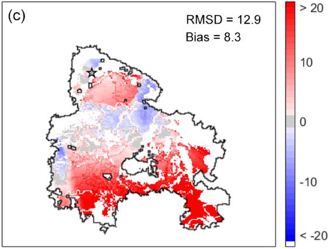

# Determining the Effect of Wind on Fire Propagation
by Elias Gabriel and Erika Lu

# Replicated Experiment
While cellular automata have often been used to simulate wildfires, a devastating fire that hit the forests of Southern Portugal in 2012 exhibited an explosive behavior that was not well captured by existing models. Models for fire spread are valuable to disaster relief organizations and volunteers, as they can help identify where relief resources can be allocated. In these cases, it is important for models to reasonably accurately predict spread patterns and disaster zones.

Freire et al. propose that the incorporation of wind speeds in forest models may create more accurate explanations of fire spread. Our objective was to verify their claims and determine whether factoring in winds creates a better model by comparing our models with real world wildfire data. We replicated their CA simulation of a wildfire that takes wind speed into account. The wind creates a new rule for the CA: the fire can now traverse to non adjacent cells.

The authors validate their results by comparing the experimental model with the official observed and recorded fire spread data. By contrasting the locations to where fire spread in the observed time interval of 46 hours, they could directly compare the performances between their model and the actual fire. They show their results in figure form.

  

  <i>Figure 1: Maps comparing the results of a basic fire propagation model and the results of their proposed wind-aware model. Red indicates area where the model was delayed in burning the terrain when compared to the actual fire. Blue indicates areas where the model was ahead in burning the terrain. Gray shows areas where the model and actual fire where aligned.</i>

Comparing the two maps, the amount of red makes it clear that the basic model does not spread as quickly as needed to match the propagation speed in real life. On the contrary the proposed model seems to keep up for the actual data, though the areas where it is ahead of the real fire shows that it leans towards over-weighting wind's effect.

The graphs they produce offer compelling evidence for the validity of their model, and show that wind speed and direction are potential principal factors in determing the spread of wildfire.
