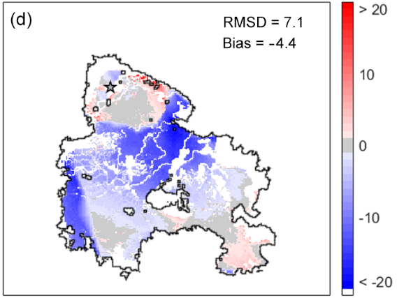

# Determining the Effect of Wind on Fire Propigation
by Elias Gabriel and Erika Lu

# Replicated Experiment
The model explored by Freire et al. attempted to better explain the propagation of the Portugal wildfire using wind’s effect in high wind speeds.

The authors validate their results by comparing the experimental model with the official observed and recorded fire spread data. By contrasting the locations to where fire spread in the observed time interval of 46 hours, they could directly compare the performances between their model and the actual fire. They show their results in figure form.

  

  <i>Figure 1: Maps comparing the results of a basic fire propigation model and the results of their proposed wind-aware model. Red indicates area where the model was delayed in burning the terrain when compared to the actual fire. Blue indicates areas where the model was ahead in burning the terrain. Gray shows areas where the model and actual fire where aligned.</i>

Comparing the two maps, the amount of red makes it clear that the basic model does not spread as quickly as needed to match the propigation speed in real life. On the contrary the proposed model seems to keep up for the actual data, though the areas where it is ahead of the real fire shows that it leans towards over-weighting wind's effect.

The graphs they produce offer compelling evidence for the validity of their model, and show that wind speed and direction are potential principal factors in determing the spread of wildfire.
