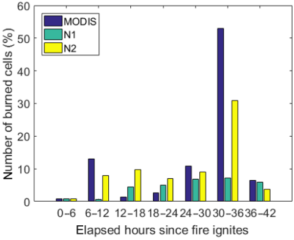
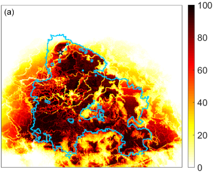

# The Effect of Wind Speed on Wildfire Spread
by Elias Gabriel, Erika Lu

## Abstract
While cellular automata have often been used to simulate wildfires, a devastating fire that hit the forests of Southern Portugal in 2012 exhibited an explosive behavior that was not well captured by existing models.

Models for fire spread are valuable to disaster relief organizations and volunteers, as they can help identify where relief resources can be allocated. In these cases, it is important for models to reasonably accurately predict spread patterns and disaster zones.

Gomes et al. propose that the incorporation of wind speeds in forest models may create more accurate predictions of fire spread. Our objective is to verify their claims and determine whether factoring in winds creates a better model by comparing our models with real world wildfire data.

## Experiment
The experiment we would like to replicate is a CA simulation of a wildfire that takes wind speed into account. The wind creates a new rule for the CA: the fire can now traverse to non adjacent cells. We will compare the spread results from our replication to those published in the paper, ideally producing graphs similar to those below:

> _Ideally, we will generate a bar chart that mimics the behavior of this one, where the modified CA gives a closer approximation of the number of burned trees than the standard model. If we get a number higher than the base model, the experiment would be a success._

> _The heat map of probabilities of burning will serve as an indicator to the reliability of our model. If we get a map that is dark in color, that would indicate that our model repeatedly predicted the same burn region for the forest over several simulation runs. A fairly stable result would serve as an argument for why our model could be a viable tool in the allocation of relief resources._

## Concerns
[We need to put concerns here].

## Next Steps
1. In the coming week, we hope to get an implementation of the basic, unmodified forest fire model working. The implementation will ideally produce results similar to that shown the Gomes paper.
2. Once we are confident our foundational model is working, we will make the wind-speed based CA rule modifications proposed in the paper.
3. Once implementation is done, we will work on interpreting our results and begin writing the draft report.
4. After the draft report is done, we will finalize it and finish the project.

## Bibliography
### Using cellular automata to simulate wildfire propagation and to assist in fire management

[https://doi.org/10.5194/nhess-19-169-2019](https://doi.org/10.5194/nhess-19-169-2019)

E. Gomes; P. Abrantes; A. Banos; J. Rocha, **Natural Hazards Earth System Sciences (2019)**: 169–179; 

> The authors experiment with a basic forest fire cellular automaton and compare their results to the real-life Algarve event in July of 2012. Based on initial tests and comparisons to the real-world fire spread rate, they suggest that the inclusion of wind and spread to non-adjacent neighbors would make the model more realistic. They experiment with a model that implements wind-caused spread and conclude that its inclusion results in a more realistic forest fire model, and that this new model can be more helpful to firefighters and disaster relief agents in determining where to combat fire spread.
